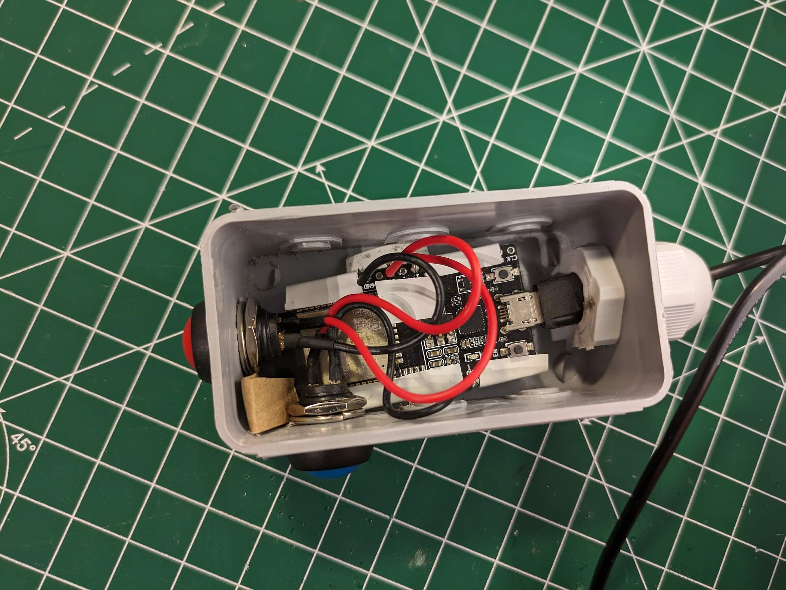
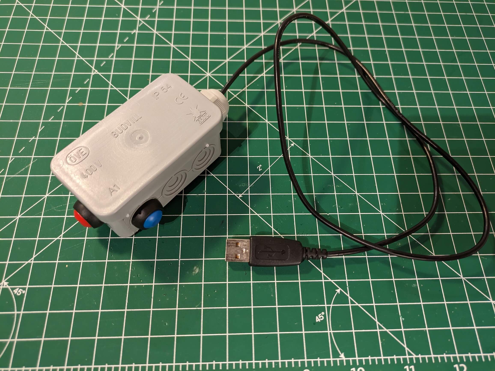

# page_turner

Arduino script for a ESP32 BLE page turner

## Requirements

I use a tablet to read music sheets.
Sometimes I do not have a rest where I can turn to the next page.
I want to hold the page turner in my hand (not a pedal switch).

## Solution

I used an ESP32 and wrote a short script in which a keyboard is emulated. (I use a library for this- TY!)
There are two buttons; one to scroll up and one to scroll down.
I use a small electrical case to hold the board. (see pictures)
The board is powered by a small power bank.

